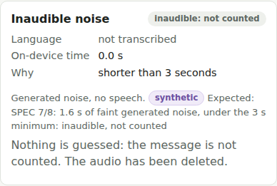
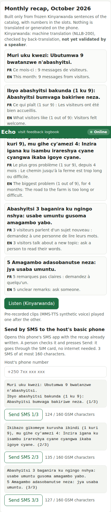
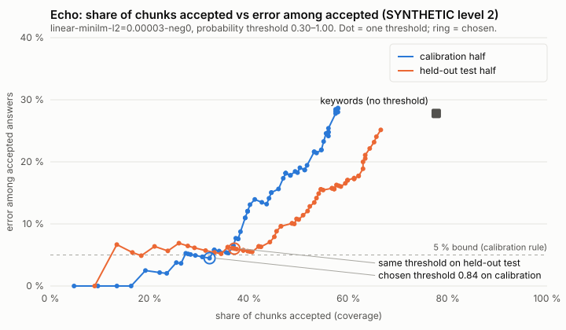

# Echo — the visit logbook for small rural tourism hosts

**Small AI for Development hackathon (World Bank × Hack-Nation, 3–4 October 2026), Tourism track.**

Visitors leave a short voice message in their own language. Echo keeps these messages, compares them month after
month, and tells the host, in Kinyarwanda, what visitors like, what to fix first and what keeps coming back that the
tool does not know. Everything runs offline, on a phone the household already owns. No server does any analysis,
and there are no accounts and no login.

> **Prototype honesty notice.** Parts of this repository are synthetic or simulated: the evaluation feedback
> corpus (levels 2–3), the test voices, the demo samples, the 3-month history in the demo, the cooperative's other
> farms, and the Kinyarwanda (machine-translated, **not validated by a speaker**). Every one is labelled in the UI
> and listed in [§12 What is simulated / synthetic](#12-what-is-simulated--synthetic). Nothing was tested on a real
> Android phone or with a real SMS yet: see [`docs/MANUAL_TESTS.md`](docs/MANUAL_TESTS.md). The APK was tested on an
> Android 14 **emulator** only, and with 2 GB of RAM the emulator killed the analysis for lack of memory (§10).

| | |
|---|---|
| Try it | `pnpm install && pnpm models:download && pnpm build && pnpm preview` → http://localhost:4173 (the app is not deployed publicly: that is the team's call) |
| Results | [`eval/results/RESULTS.md`](eval/results/RESULTS.md) (generated by `pnpm eval`) |
| Data sheet | [`docs/DATASHEET.md`](docs/DATASHEET.md) |
| Video script | [`docs/VIDEO_SCRIPT.md`](docs/VIDEO_SCRIPT.md) (the video itself is to be recorded by the team) |
| Spec (French, source of truth) | [`docs/SPEC.md`](docs/SPEC.md) · build log: [`docs/PROGRESS.md`](docs/PROGRESS.md) · architecture: [`docs/ARCHITECTURE.md`](docs/ARCHITECTURE.md) |

Contents: [1 Problem and users](#1-the-problem-and-the-users) · [2 User journey](#2-the-full-user-journey) ·
[3 What the AI does](#3-what-the-ai-does-and-why-a-simple-tool-is-not-enough) · [4 Guardrails](#4-guardrails) ·
[5 Measured results](#5-measured-results) · [6 Data sheet](#6-data-sheet) · [7 Responsible AI](#7-responsible-ai) ·
[8 Less-supported language](#8-a-less-supported-language) · [9 Replicability](#9-replicability-and-next-steps) ·
[10 Limitations](#10-limitations) · [11 Technical](#11-technical-section) · [12 Simulated / synthetic](#12-what-is-simulated--synthetic) ·
[13 Our take: localizing AI development](#13-our-take-localizing-ai-development)

---

## 1. The problem and the users

**Noor** (the brief's reference user) is 38 and farms 2 hectares in the Ondera highlands: coffee on the upper
slope, maize and beans below. She has been in a coffee cooperative for 11 years and speaks Kinyarwanda (for this
project) and the national language. The household has two phones: her own **basic phone** (calls, SMS, mobile
money) and her 16-year-old daughter's **smartphone**, mostly at home at weekends. There is no Wi-Fi; they buy 3G
bundles when needed. Six or seven visitors a month find the farm by word of mouth; they come with a local guide who
translates. **Once they leave, Noor never learns what they liked, what was missing, or what is worth building on.**

The World Bank brief (Annex C) names this exact gap: small operators "know visitors leave happy, but not why, not
which parts of the experience are worth building on", and places the value of AI in reading "a scattered set of
reviews and messages" to tell the operator "what visitors keep returning to, what they wish had been different".

**Who Echo is for:** small rural tourism hosts with no platform and no staff (farm visits, homestays, craftspeople).
Two modes:
- **Mode A**: the host has an Android phone, even an entry-level one. Everything happens on it.
- **Mode B**: the host has only a basic phone, like Noor. The analysis runs on the household smartphone; the host
  receives the monthly recap **by SMS** on her basic phone and can listen to it on the smartphone. Noor (mode B) is
  the reference case.

Why this matters (sources and licenses in [§6](#6-data-sheet)): tourism brought Rwanda US$ 635.9 M in 2019,
28.2 % of its exports (UN Tourism series via World Bank WDI); in Rwanda, 23 % of women own a smartphone against 37 %
of men, and 36 % of women have a basic or feature phone as their best handset (GSMA 2025 report, 2024 survey), so the
recap must reach the host by SMS and voice; OpenStreetMap shows **zero** farm-tourism objects within 15 km of three
Rwandan coffee areas (our Overpass query, 2026-10-03): small farms receiving visitors are invisible in public data.

### The problem sentence (SPEC 13, with our measured numbers)

> "Because of this tool, small rural tourism hosts like Noor will know every month what visitors loved and what to
> fix first, which today they never learn once visitors leave; we know because the World Bank brief describes this
> exact gap, and our tests show the tool captures **48 %** of visitor remarks versus **88 %** for keyword matching."

We report X < Y as measured, and it needs its context to be read correctly:

- **Definition.** A *remark* is a passage of a feedback annotated as expressing one catalog finding (P1–N10). It is
  *correctly captured* when the system counts exactly that finding on a chunk overlapping the passage. Measured on
  the held-out half of our **synthetic** written corpus (152 remarks in 125 feedbacks), same remarks for both methods.
- **Of the answers each method counts, the share that is wrong:** Echo **6 %** [95 % CI 3–13], keywords **28 %**
  [22–34]. Keywords count "the walk was **not** too long" as a complaint and "delicious coffee" as a meal.
- **Echo routes the rest to a person:** 41 % of remarks are flagged "not sure — ask a person" instead of being
  guessed. Remarks counted right or flagged for a person: Echo 89 %, keywords 88 % (keywords have no such flag).
- End to end on synthetic audio with outdoor noise (10 dB SNR): Echo captures 35 % with 3 % wrong; keywords 69 % with
  33 % wrong.

In one line: **Echo counts fewer remarks by itself, but what it counts is right about 19 times out of 20, and it
says when it does not know; keyword matching counts more, gets about one answer in four wrong, and never says so.**
The host acts on the counts, so we chose a low wrong-answer rate over coverage (threshold rule in §5.3).

## 2. The full user journey



1. **Collection.** At the end of the visit the host hands the visitor a **printed card** in English, French, German
   and Spanish (`#/card` in the app, printable): "Tell us in 30 seconds what you liked and what was missing. Send a
   WhatsApp voice message to this number. The sound is deleted after analysis and your name is not kept." Sending the
   message is the visitor's consent, and the card says so. The visitor uses their own phone; with no signal at the
   farm, WhatsApp sends it later on its own. Written messages are accepted too (same path, no transcription).
2. **Reception.** Messages arrive on the smartphone that holds the farm's number. Whoever has it **shares** them to
   Echo in one gesture (Android share sheet → Echo, via the Web Share Target of the installed app), or imports a file
   / pastes text. Echo puts them in a queue. From here on, nothing needs the internet.
3. **Offline analysis on the phone** (Web Worker, models from the phone's own cache):
   1. **Whisper base** transcribes and detects the language (our own detection pass; transformers.js has none).
   2. **The audio is deleted** from the queue as soon as transcription ends, and the buffer is zero-filled.
   3. **Names, phone numbers, e-mails and @handles are scrubbed** before anything is stored.
   4. The text is **split into sentences, then clauses** ("but", "mais", "aber", "pero"…).
   5. A **multilingual sentence-embedding model** (MiniLM) embeds each chunk; a small classifier trained on the
      catalog's example sentences gives a probability per finding. Accepted only if ≥ the calibrated threshold
      (0.84) **and** the negation agrees; at most 2 findings per chunk.
   6. Below the threshold, low transcription confidence, unclear negation → **"not sure"**.
   7. Unlike any finding (cosine below the floor 0.59) → **"off-list"**.
4. **"Not sure": flag, never guess.** Never counted. The recap says "{p} … not understood: ask a person". A read-only
   list **"To be read by a person"** shows the scrubbed original text and, when no chunk of the message was counted,
   Whisper's English translation of the message labelled "machine translation, to be checked" (for a message with a
   counted chunk, the translation is shown once right after analysis and not stored). The guide, the daughter or someone from the cooperative can read them; the
   tool never decides for them.
5. **Unknown topics that come back.** Off-list and below-threshold chunks are clustered by meaning. When one cluster
   spans **≥ 3 different visitors**, the recap says "a topic the tool does not know comes back from {k} visitors:
   ask a person to read these remarks". Echo never names the topic (it has no validated sentence for it). The catalog
   grows only when someone edits the catalog file.
6. **Monthly recap for the host**, built **only** from frozen Kinyarwanda sentences of the catalog with digits in
   numeric slots, at most 5 lines: volume; what to keep (most-cited positive, "k out of n"); what to fix first
   (most-cited negative with ≥ 2 mentions or 2 months in a row, "for x months" when it repeats; otherwise "no big
   problem this month"); recurring unknown topic; remarks not understood. A month with no message: "No message from
   visitors this month." Delivered two ways:
   - **a real SMS** from the Android's SIM to the host's basic phone, with no internet: Echo opens the phone's own SMS
     app pre-filled (`sms:` link), split into ≤ 160-character GSM-7 parts, and **a person presses Send**. A full
     5-line recap is 3 SMS; the demo recap of the end-to-end test was 2;
   - **audio**: pre-generated Kinyarwanda clips (MMS-TTS) played one after the other on the smartphone.
   Echo never triggers any action. The host alone decides what to change.

   

   Example (computed with the shipped code and catalog for a 7-message month):

   | Kinyarwanda (what the host gets) | English gloss (catalog source sentence, shown only in the demo / helper view) |
   |---|---|
   | Muri uku kwezi: Ubutumwa 7 bwatanzwe n'abashyitsi. | This month: 7 messages from visitors. |
   | Ibyo abashyitsi bakunda (3 ku 7): Abashyitsi bakundaga guteka no gusogongera ikawa. | What visitors like (3 out of 7): Visitors liked roasting and tasting the coffee. |
   | Ikibazo gikomeye kurusha ibindi (2 kuri 7), mu gihe cy'amezi 2: Inzira igana ku isambu irareshya cyane cyangwa ikaba igoye cyane. | The biggest problem (2 out of 7), for 2 months: The road to the farm is too long or difficult. |
   | Hari igitekerezo cyihariye cyagarutse ku basura 3: usabe umuntu gusoma izo message. | An unknown topic comes back from 3 visitors: ask a person to read these messages. |
   | Ubutumwa 2 ntibwasobanukiwe: baza umuntu. | 2 messages were not understood: ask a person. |

7. **Cooperative view (bonus).** Anonymous counts per finding across farms that consented ("5 farms out of 12: path
   too long"). Remarks about the guide never leave the host's view. **In this prototype the other farms are
   synthetic and nothing is sent anywhere** (see §12).

The **"Try it" web demo** (`#/`, default page) runs the same pipeline with no account: 10 one-click synthetic voice
samples, a 30 s recorder, typed text, per-message transcript / language / chunks / findings with confidence /
not-sure in orange / off-list apart, a keyword-vs-Echo comparison, the Kinyarwanda recap with FR/EN glosses and a
Listen button, 3 synthetic months of history with trends, the "To be read by a person" list, an "Offline" badge and a
model box ("everything runs on this device", sizes). After the first load it works with the network cut (tested in
headless Chromium, §11.4).

## 3. What the AI does, and why a simple tool is not enough

**Echo is not a translator.** Google Translate or a guide translate better during the visit, and Echo does not
replace them. Echo works **after** the visit: it keeps the remarks, counts them, compares months and spots what comes
back. It never shows the host a free translation and never generates free text for the host.

What the models do, and nothing else:

| Step | Model | Why a model is needed |
|---|---|---|
| Speech → text, language detection | Whisper base (q8 ONNX, 79.7 MB) | Visitors speak; four languages; a voice note is the lowest-effort way for a visitor to give feedback |
| Remark → one of 21 findings, or "not sure", or "off-list" | paraphrase-multilingual-MiniLM-L12-v2 (q8, 135.4 MB) + a logistic-regression layer trained on 756 catalog examples | The same idea is said in countless ways in four languages ("we walked forever", "der Weg war endlos", "el camino se hizo eterno"); a keyword list misses paraphrases and cannot tell "not too long" from "too long" |
| Grouping unknown remarks by meaning | Same embeddings, average-linkage clustering | A recurring new topic (e.g. coffee-cherry picking) is phrased differently by each visitor |

**Why not a simpler tool?** An SMS survey or a form forces visitors into fixed boxes in a language they may not read,
and gets few answers; a spreadsheet needs someone to read, translate and tally voice notes in four languages every
month; a keyword search counts negations and look-alike words as findings (measured: 28 % of its counted answers are
wrong, 0 % of cancelling negations handled, vs 6 % and 85 % for Echo). The analytical work is exactly what the brief
says small operators cannot do for themselves.

| | Google Translate | A local guide | A form / SMS survey | **Echo** |
|---|---|---|---|---|
| When it helps | During the visit | During the visit | After the visit | **After the visit, every month** |
| Captures what visitors liked / missed | No (translates on demand) | Only what is said in front of him, and remarks about the guide himself are awkward | Only what fits the boxes | **Yes: every voice or text message, in en/fr/de/es** |
| Counts and compares month to month | No | No (memory) | Needs someone to tally | **Yes: "k out of n", "for x months"** |
| Spots a new topic that comes back | No | Maybe | No (closed questions) | **Yes: ≥ 3 visitors, never named, sent to a person** |
| Reaches a host with a basic phone, in Kinyarwanda | No (needs a smartphone, free text) | Yes, orally | No | **Yes: SMS + audio, frozen sentences only** |
| Works offline | Partially (offline packs) | Yes | Paper: yes | **Yes: all analysis on the phone** |
| Says when it is unsure | No | n/a | n/a | **Yes: "not sure — ask a person"** |
| Can hallucinate to the host | Free translation can be wrong | n/a | No | **No: closed list of ~30 frozen sentences** |

## 4. Guardrails

- **Closed list of output sentences.** The host only ever sees or hears frozen Kinyarwanda sentences from
  `catalog/catalog.json` (21 finding sentences + 8 templates) with digits in numeric slots. Nothing is translated or
  generated at runtime. A core test builds 1,000 random months and asserts every recap line is exactly a catalog
  template; the recap throws rather than fall back to any other text if a sentence is missing.
- **"Not sure" is never counted and always flagged** with "ask a person": below the calibrated probability, low
  transcription confidence, low language probability, unsupported language (whole message), uncertain negation
  (litotes, double negation, attenuation).
- **Negation agreement rule.** Each catalog example is tagged negated or not; a chunk is only accepted through
  examples with the same negation status. "The path was not too long" never gives N1; "there was no shade" still gives
  N8. Measured: 85 % of cancelling negations handled on the held-out half (keywords 0 %).
- **Inaudible messages** (under 3 s, silence, steady noise, Whisper phantom texts like "[Music]", very low
  confidence) are marked inaudible and never counted; audio that fails the duration/silence/noise checks is not even transcribed.
- **Duplicates** (same normalised text, or message embedding cosine ≥ 0.98 within 7 days) are counted once.
- **At most 2 findings per chunk**; each finding counted once per message ("k out of n" counts visitors' messages).
- **Unknown topics are never named**; they are only pointed out for a person to read.
- **Human in the loop everywhere:** the SMS app opens pre-filled and a person presses Send; Echo never acts, never
  replies to visitors, never changes the catalog itself.
- **Privacy by construction:** audio deleted after transcription, PII scrubbed before storage, only findings stored
  for each message, nothing sent to any cloud (§7).
- **Every synthetic or simulated element is labelled** in the UI and here (§12).

## 5. Measured results

All numbers come from `pnpm eval`, which runs the **shipped code** (`@echo/core` + `@echo/models`, same models and
thresholds as the app). Full tables, definitions and honesty notes: [`eval/results/RESULTS.md`](eval/results/RESULTS.md).
**Level 1 uses real human voices. Levels 2 and 3 are SYNTHETIC** (feedback written by the team; level 3 spoken by
synthetic voices mixed with real outdoor noise): treat them as an upper bound on real-world quality.

### 5.1 Level 1 — Whisper on real human voices (FLEURS test, 100 utterances per language; small: 50)

Word error rate (WER), q8 ONNX, greedy decoding, automatic language detection as in the app.

| Model (size) | en | fr | de | es | sw (bonus) | Language detected right (en/fr/de/es) |
|---|---:|---:|---:|---:|---:|---|
| whisper-tiny (43.6 MB) | 29.9 % | 67.1 % | 51.6 % | 30.4 % | 102.8 % | 99–100 % |
| **whisper-base (79.7 MB, shipped)** | **10.5 %** | **28.7 %** | **21.6 %** | **12.3 %** | 101.3 % | 99–100 % |
| whisper-small (251.8 MB) | 8.6 % | 14.0 % | 11.5 % | 6.1 % | 77.1 % | 100 % |

Swahili is unusable with these sizes (WER ≥ 77 %): Echo treats it as an unsupported language (→ "not sure").

### 5.2 Level 2 — classifying written feedback (SYNTHETIC, held-out half: 125 feedbacks)

250 synthetic feedbacks in en/fr/de/es (typos, very short and long, negations, multi-finding, ~11 % off-list,
17 ambiguous, 3 about coffee-cherry picking), annotated, disjoint from the catalog examples, split 125 calibration /
125 held-out test.

| | Precision | Recall | F1 | **Error among accepted answers** | Remarks captured | Not-sure rate (chunks) | Off-list rate (chunks) | Cancelling negations handled |
|---|---:|---:|---:|---:|---:|---:|---:|---:|
| **Echo** | **0.95** | 0.50 | 0.66 | **6.0 %** [3–13] | 48.0 % | 43.8 % | 19.2 % | **84.6 %** |
| Keywords (no AI) | 0.71 | 0.89 | 0.79 | 27.8 % [22–34] | 87.5 % | 0 % (no such state) | 22.3 % | 0 % |

Precision / recall / F1 are message level (predicted set of findings vs annotated set); error among accepted answers
is at chunk level (each (chunk, finding) the system counts that does not match the annotation) and is the most
important safety measure. Ambiguous feedbacks given a finding: Echo 2/8, keywords 5/8. Off-list feedbacks given a
finding: Echo 0/15, keywords 5/15.

Per language (held-out half):

| Lang | Echo P | Echo R | Echo F1 | Echo error among accepted | Echo captured | Echo not sure | Keywords F1 | Keywords error among accepted |
|---|---:|---:|---:|---:|---:|---:|---:|---:|
| en | 0.96 | 0.58 | 0.72 | 4.2 % | 56.4 % | 26.3 % | 0.82 | 23.5 % |
| fr | 1.00 | 0.50 | 0.67 | 0.0 % | 50.0 % | 52.0 % | 0.72 | 35.3 % |
| de | 0.90 | 0.43 | 0.58 | **15.0 %** | 40.5 % | 53.8 % | 0.76 | 31.6 % |
| es | 0.95 | 0.51 | 0.67 | 4.8 % | 46.0 % | 42.3 % | 0.85 | 19.6 % |

Per finding, Echo's precision is 1.00 for 18 of the 21 findings (N3 0.71, N9 0.75, N7 0.80); its recall ranges from
0.17 (N4 visit too short) and 0.25 (P6, P11) to 1.00 (P10, N2). Full per-finding table in RESULTS.md.

**Confusion matrix highlights** (Echo, held-out half, annotated passage → what Echo did): **only 2 of the 152
remarks were counted as another finding** (one P2 field visit → P5 explanations; one N9 waiting → N8 thirst/no break);
everything else not captured went to "not sure" (most) or off-list. Annotated off-list passages: 10 off-list, 5 not
sure, 0 counted. Ambiguous passages: 5 not sure, 1 off-list, 2 counted as N3. Negated passages: 2 counted (N7, N9),
11 not sure / off-list. The weakest findings by recall (P11 general thanks 3/13, P3 roasting 3/11) mostly fall to
"not sure", not to a wrong finding.

### 5.3 The threshold: share of chunks handled vs error, and why 0.84



Rule, decided on the **calibration half only**: off-list floor first (Youden index, 0.59), then the acceptance
threshold that **maximises remarks captured subject to error among accepted answers ≤ 5 %, ≥ 20 accepted answers and
cancelling-negation accuracy ≥ 85 %**; the same rule picked the variant (embedding model, scoring, regularisation).
Chosen: MiniLM + linear classifier, accept when probability **≥ 0.84**. On the calibration half: capture 46.2 %, error
4.5 %, coverage 32.1 % of chunks. On the held-out half: capture 48.0 %, error 6.0 % [3–13]. The original rule (cosine
to the nearest catalog example) never got under 5 % error at any threshold (≥ 20 % even at high thresholds), which is
why the linear layer exists. We value a wrong count more than a missed one: the host would act on a wrong count,
while a missed remark goes to a person. The values are written to `packages/core/src/calibration.ts`, which the app
reads. Honesty note: some test-half numbers were seen by intermediate runs before three procedure changes (listed in
RESULTS.md); the test half is not perfectly untouched.

### 5.4 Level 3 — end to end on audio (SYNTHETIC voices + real outdoor noise)

80 feedbacks (20 per language) spoken by 13 Piper TTS voices at varied speeds, mixed with ESC-50 outdoor noise at 20,
10 and 5 dB SNR, through the whole app path (audio checks → Whisper → audio wiped → analysis).

| Input (whisper-base) | WER | Language right | Inaudible (of 80) | Echo captured | Echo error among accepted | Echo F1 | Echo not sure | Keywords captured | Keywords error among accepted |
|---|---:|---:|---:|---:|---:|---:|---:|---:|---:|
| Text, same 80 messages (level 2) | – | – | – | 42.9 % | 8.7 % | 0.60 | 50.0 % | 89.0 % | 32.3 % |
| Clean + 0.4 s silence | 13.7 % | 100 % | 12 | 40.7 % | 0.0 % | 0.60 | 47.8 % | 71.4 % | 32.5 % |
| 20 dB SNR | 13.6 % | 100 % | 12 | 37.4 % | 7.3 % | 0.57 | 44.9 % | 70.3 % | 33.6 % |
| **10 dB SNR** | 17.5 % | 100 % | 12 | **35.2 %** | **2.7 %** | 0.56 | 47.8 % | 69.2 % | 33.0 % |
| 5 dB SNR | 23.9 % | 97 % | 14 | 30.8 % | 8.3 % | 0.51 | 49.7 % | 65.9 % | 32.4 % |

Loss vs text: about −8 points of capture at 10 dB, with the error among accepted answers staying under 10 % in every
condition. 12 of the 80 clips are under 3 s ("Thanks!", "Meh.") and are inaudible by design. Tiny and small rows are
in RESULTS.md.

Per language at 10 dB SNR (whisper-base, 20 clips per language, SYNTHETIC voices). P / R / F1 at message level; error
among accepted with its 95 % interval and the number of accepted answers; not sure = share of chunks:

| Lang | WER | Echo P | Echo R | Echo F1 | Echo error among accepted | Echo captured | Echo not sure | Keywords F1 | Keywords error among accepted | Keywords captured |
|---|---:|---:|---:|---:|---:|---:|---:|---:|---:|---:|
| en | 11.3 % | 1.00 | 0.41 | 0.58 | 0.0 % [0–30] (9 accepted) | 39.1 % | 37.5 % | 0.75 | 32.1 % (28 accepted) | 78.3 % |
| fr | 22.1 % | 1.00 | 0.43 | 0.61 | 0.0 % [0–28] (10 accepted) | 34.8 % | 52.6 % | 0.74 | 33.3 % (33 accepted) | 73.9 % |
| de | 21.9 % | 0.88 | 0.35 | 0.50 | 12.5 % [2–47] (8 accepted) | 35.0 % | 48.6 % | 0.51 | 42.9 % (21 accepted) | 45.0 % |
| es | 15.4 % | 1.00 | 0.36 | 0.53 | 0.0 % [0–28] (10 accepted) | 32.0 % | 55.9 % | 0.75 | 26.7 % (30 accepted) | 76.0 % |

With 8 to 10 accepted answers per language the intervals are very wide: the only wrong accepted answer at 10 dB is
German. The same table for clean speech, the per-finding table and the confusion matrices are in
[`eval/results/RESULTS.md`](eval/results/RESULTS.md) ("Level 3 in detail").

**Which Whisper.** Rule: the smallest model with FLEURS WER ≤ 30 % in every visitor language **and**, at 10 dB, error
among accepted ≤ 10 % with capture at most 10 points below the best model. Tiny fails (FLEURS fr 67 %, de 52 %; 10 dB
capture 20.9 %); **base passes** (35.2 % vs 40.7 % for small, 3.2× smaller). The rule was written after seeing the
numbers; the table lets the reader apply another.

### 5.5 Unknown topic that comes back (coffee-cherry picking, 3 visitors)

| Clustered chunks | Picking flagged in realistic months (6–7 visitors, 500 simulated months) | Months with a false alert (500) |
|---|---:|---:|
| Off-list only (literal SPEC 4.5) | 0 % | 0 % |
| **Off-list + below-threshold "not sure" (shipped)** | **98 %** | **0.6 %** |

The three picking remarks land in "not sure" (close to "field visit"), so the literal off-list-only rule never fires;
the shipped rule also clusters below-threshold "not sure" chunks. This choice and the cluster threshold (0.59) were
made after seeing the picking result, and there is no second recurring topic to validate them blind. Stress test with
all 250 feedbacks as one month: picking flagged, but 19 false alerts, so the signal suits one farm, not a
cooperative-wide feed. In the web demo the three picking samples trigger the signal.

**Duplicates:** exact re-sends 100 % caught, case/punctuation variants 98 %, 1 false duplicate among 125 distinct
feedbacks, 0 for the same text a month later.

### 5.6 Echo vs keywords (summary)

| | Echo | Keywords |
|---|---:|---:|
| Remarks captured, text (held-out) | 48 % | 88 % |
| Error among accepted answers, text | **6 %** | 28 % |
| Says "not sure" instead of guessing | yes (41 % of remarks) | never |
| Cancelling negations handled | **85 %** | 0 % |
| Off-list feedbacks given a finding | **0/15** | 5/15 |
| Audio 10 dB: captured / error among accepted | 35 % / **3 %** | 69 % / 33 % |

The keyword lists were written by the same author as the synthetic corpus, which favours the baseline.

### 5.7 Size, memory, speed

| | |
|---|---|
| Shipped models (q8 ONNX) | whisper-base 79.7 MB + MiniLM 135.4 MB = **215.1 MB** (tiny would be 43.6 MB, small 251.8 MB) |
| One-time download of the web app | ≈ 242 MB (models + 27 MB WebAssembly runtime) + app shell, catalog, clips, samples; side-loadable by copying `models/` |
| Catalog + Kinyarwanda audio | 68 MP3 clips, ~360 KiB |
| Side-loadable debug APK (models bundled) | ~150 MB (157 MB file) |
| Memory (laptop, Node process, whisper-base) | 885 MB after loading, **peak 1.2 GB** (native runtime libraries + file buffers) |
| Memory in the APK's WebView (**Android 14 emulator**, not a phone) | renderer ≈ **1.55 GB** once both models are loaded. **2 GB of RAM: the renderer was killed by low memory during transcription** (the app now restarts the page with a message); **3 GB: works** |
| 30 s message, laptop (Intel Core Ultra 5 226V), 1 thread | **3.3 s** (4.3 s with the English translation for the review list); 8 threads: 4.7 s / 5.2 s on a shared CPU |
| 30 s message, **low-end Android: ESTIMATE, not measured** | **~33–87 s** (~43–114 s with translation) = 1-thread laptop time × measured WebAssembly overhead (×3.3) × assumed 3–8× per-core gap |
| In the browser (headless Chromium, this laptop) | first load 11 s from localhost; the 10 demo samples (≈ 51 s of audio) analysed in 25 s; offline reload ready in 3 s |
| APK on an **Android 14 emulator** (KVM, 2 vCPUs, airplane mode; emulator, not a phone; WASM on 1 thread in the APK) | offline start with the bundled models: 2 GB 29 s first load then 10–11 s, 3 GB 19 s. With 3 GB: a **6 s sample transcribed and matched in 18.4 s**; a shared `.opus` voice note analysed from the queue in 6.5 s. With 2 GB: no result (renderer killed, see above) |

Messages are processed in a background queue, so minutes per message would still be usable for 6–7 messages a month,
but the phone timing must be measured: an emulator on a laptop CPU says little about a low-end phone's CPU or its
memory killer. Procedure in [`docs/MANUAL_TESTS.md`](docs/MANUAL_TESTS.md). The 2 GB emulator result means Echo, as
shipped, needs about 3 GB of RAM; lowering it (loading MiniLM only after Whisper, or whisper-tiny on small phones) is
not done.

## 6. Data sheet

The complete data sheet, with every license checked on its primary page (URL and access date), is
[**`docs/DATASHEET.md`**](docs/DATASHEET.md). Summary:

**Data that shows the problem (Rwanda)**

| Source | Figure | License | Does not cover |
|---|---|---|---|
| UN Tourism series via World Bank WDI (`ST.INT.*`) | 1.634 M arrivals, US$ 635.9 M receipts = 28.2 % of exports (2019) | CC BY 4.0 (WDI) | Nothing after 2019/2020 in WDI; no rural or farm split |
| Rwanda Development Board, 2024 | US$ 647 M revenue, 1.36 M visitors | quoted with attribution | Different visitor definition |
| World Bank Enterprise Surveys, Rwanda 2023 | Access to finance is the top obstacle for 30.0 % of small firms | public report, quoted | **Excludes agriculture, firms under 5 employees and informal firms**: a family farm is out of scope |
| GSMA Mobile Gender Gap 2025 (2024 survey) | Smartphone ownership: women 23 %, men 37 %; 36 % of women have a basic/feature phone as best handset | © GSMA, quoted | One survey of ~1,000 adults, no rural breakdown; Rwanda absent from the 2026 edition |
| OpenStreetMap via Overpass (our query) | 0 farm-tourism objects, 1 coffee tourist attraction within 15 km of Huye, Nyamasheke, Gakenke | ODbL | Volunteer coverage; a zero measures what is mapped |

**Data and models used to build and evaluate Echo**

| Name | License | Size | Use | Does not cover |
|---|---|---|---|---|
| Whisper base (tiny, small evaluated) | MIT | 79.7 MB (43.6 / 251.8) | On-device ASR + language detection | No Kinyarwanda; weaker outside English |
| paraphrase-multilingual-MiniLM-L12-v2 | Apache-2.0 | 135.4 MB | Matching chunks to findings; back-translation scoring | No Kinyarwanda; no negation understanding (rule added) |
| multilingual-e5-small (candidate) | MIT | 135.4 MB | Compared, not shipped | – |
| FLEURS (test split) | CC BY 4.0 | 100 utt./language used (en, fr, de, es, sw) | Level 1 WER on real voices | Read speech, quiet rooms; no Kinyarwanda |
| Mozilla Common Voice | CC0 | **not used** (Mozilla Data Collective needs an account) | – | – |
| NLLB-200 distilled 600M + FLORES-200 reference | CC BY-NC 4.0 (model), CC BY-SA 4.0 (FLORES) | 2.46 GB, build time only | Kinyarwanda catalog + back-translation; published chrF++ eng→kin **44.0** | Not validated by a speaker; non-commercial |
| MMS-TTS Kinyarwanda | CC BY-NC 4.0 | 145 MB, build time only | 68 recap clips | One synthetic voice, unchecked pronunciation; non-commercial |
| Piper TTS voices (**synthetic voices**) | engine GPL-3.0 (build-time tool); voices CC0 / CC-BY / CC-BY-SA / Unlicense | 13 voices, 80 clips, 6.5 min per condition; 10 demo samples | Level 3 audio, demo samples | Studio read speech, no hesitations, no non-native accents |
| ESC-50 outdoor noise | CC BY-NC 3.0 (ESC-10 CC BY 3.0); clips kept only if Freesound source is CC0/CC-BY | 48 clips × 5 s, 12 classes, mixed at 20/10/5 dB SNR | Level 3 noise | Not recorded on a Rwandan farm; no wind on the mic |
| Visitor feedbacks (**synthetic**, ours) | released with the project | 250 feedbacks, 137 KB | Levels 2 and 3 | Written by people who know the catalog |
| Catalog examples (**synthetic**, ours) | released with the project | 756 sentences (21 findings × 9 × 4 languages) | Classifier training | Authored, not collected |
| Kinyarwanda number words 0–31 (ours, hand-written from Omniglot, languagesandnumbers.com, Harvard ELIAS) | word forms are facts of the language, no text copied; clips MMS-TTS (CC BY-NC 4.0) | 32 words + 32 clips | Numbers spoken in the audio recap (SMS and screen use digits) | No noun-class agreement ("gatatu", not "abashyitsi batatu"); not validated by a speaker |

**What the data does not cover:** there is no public corpus of visitor feedback on farm visits in Africa (we searched;
the closest, a TripAdvisor destination-review set and an en–kin tourism translation corpus, are listed and not used);
our feedbacks are written and our test voices synthetic, cleaner than real visitors outdoors; the Kinyarwanda is
machine-translated and not validated by a speaker; Whisper is weaker outside English and has no Kinyarwanda. Three
licenses are non-commercial (NLLB-200, MMS-TTS, ESC-50), fine for a prototype.

**Echo creates the missing data:** structured feedback per farm (21 findings counted per month, "not sure" items for
a person, off-list topics) and, with the host's consent, aggregated counts per cooperative.

## 7. Responsible AI

**Consent.** The printed visitor card states that sending a message is consent, that the sound is deleted after
analysis and that the name is not kept (four languages). Sending is voluntary and from the visitor's own phone.
Cooperative sharing is a separate host consent, **off by default**, revocable in Settings.

**Where the data lives and who reads it.**

| Data | Where | Who can read it |
|---|---|---|
| Audio | Queue in the phone's browser storage (IndexedDB) **until transcription ends**, then deleted; the buffer is zero-filled | Nobody after transcription |
| Full transcript (and, for a message with a counted chunk, its English machine translation) | Memory only, during analysis; shown once in "Just analysed" | Never stored |
| Per message: date, language, findings + confidence, status, counts, a non-reversible text fingerprint | IndexedDB on the phone | Whoever opens Echo on that phone (PIN optional) |
| Message embedding (384 numbers, near-duplicate detection only) | IndexedDB on the phone, **kept 7 days for duplicate detection**, then removed from the record (at app start and before each queue run) | Whoever opens Echo on that phone |
| Scrubbed text of "not sure" / off-list chunks | IndexedDB on the phone | The host and the person she asks to read them |
| Scrubbed English machine translation of the whole message | IndexedDB on the phone, **only when every chunk of that message is "not sure" or off-list** (the whole message is under review anyway); otherwise never stored | The host and the person she asks to read them |
| Names, visitor phone numbers, e-mails | **Never stored** (scrubbed before storage) | – |
| Anything in the cloud | **Nothing**: no server, no analytics, models served from the app's own origin | – |
| Cooperative | Counts per finding only, never text, never guide remarks; prototype sends nothing (synthetic farms) | – |

The WhatsApp message itself stays in WhatsApp on the farm phone: Echo cannot delete it there; the household decides.
The end-to-end test checks that IndexedDB contains no name, no phone number and no full text after analysis, and that
no English translation is stored for a message with a counted chunk (the German sample).

**Lost or shared phone.** An optional **PIN** (4–8 digits; only a salted PBKDF2-SHA256 hash, 150,000 iterations, is
stored) locks the host app, settings and cooperative view; the public "Try it" demo stays open. "Delete all
messages" wipes everything in one tap. Limits, stated plainly: the PIN is an app lock, **not encryption** — someone
with the unlocked phone and browser developer tools could read IndexedDB; what they would find is findings, dates and
scrubbed review chunks, never audio, names or numbers. There is no remote wipe.

**Quality gaps by language (measured).** Whisper base on real voices: WER en 10.5 %, es 12.3 %, de 21.6 %,
fr 28.7 %. On synthetic text, Echo's error among accepted answers is 4.2 % en, 0 % fr, 4.8 % es but **15.0 % de**
(our worst), and it captures 56 % of English remarks vs 41 % of German ones; it says "not sure" about twice as often
in French and German (52–54 % of chunks) as in English (26 %). So French and German visitors are more often routed to
a person, and German errors are the ones to watch. Swahili (WER ≥ 77 %) and any language outside en/fr/de/es are
treated as unsupported: the whole message is "not sure", never guessed. On the host side, the Kinyarwanda is the same
~30 sentences for everyone, machine-translated and unvalidated (§8).

**"Not sure" is always flagged, never guessed.** No "not sure" chunk is ever counted (core rule + test), and the
recap always carries the "ask a person" line when there are any. The review list is read-only; the tool never asks the
reader to pick a finding and never learns from them silently.

**Criticism of the guide.** Chunks that mention the guide are flagged; they count in the host's own recap (the host
should know), but are **excluded from the cooperative view and any export**, since the guide may be known to the
cooperative. The guide's name is scrubbed like any name ("our guide Eric" → "[nom]"). In the "To be read by a
person" list they carry a badge "about the guide: host only", so the host can choose someone other than the guide to
read them. Nothing technical stops the guide from reading the list if the host hands him the phone: that is the
host's decision, and we say so.

**Biases we know of.** The catalog, the keyword lists and the evaluation corpus were written by the same team (style
shared, even though near-duplicates are checked); synthetic voices are native, clear and read; the catalog reflects
what we imagined visitors say about a coffee farm.

## 8. A less-supported language

The jury asks how the tool behaves with a language that is less well covered. Two answers:

1. **Host side: Kinyarwanda is only ~30 frozen sentences** (21 finding sentences + 8 recap templates, plus number
   words 0–31), produced once with NLLB-200 and checked by back-translation (all ≥ 0.75 similarity, mean 0.87; drifts
   listed in [`catalog/README.md`](catalog/README.md)). No model ever runs for the host. For a language that machine
   translation covers badly, **a speaker can simply write these sentences and record them**, with no model at all: edit
   `rw` in `catalog/catalog.json`, record the clips, set `status: "speaker_validated"`, run the validator (procedure in
   `docs/MANUAL_TESTS.md`).
2. **Visitor side: a badly recognised language falls into "not sure".** If Whisper detects a language outside
   en/fr/de/es, or detects any language with low probability, or transcribes with low confidence, the whole message is
   "not sure" and goes to a person; nothing is counted. Measured on the 250 written feedbacks: language detection was
   **237 right, 12 "unknown"** (very short texts such as "Meh." or "Klasse!" → whole message "not sure"), and **1
   detected as another supported language** (the Spanish "Duró apenas media hora, nos supo a poco." taken for English,
   so it was analysed as English; it is in the calibration half). On FLEURS, Swahili (WER 101 % with base) is treated
   as unsupported.

## 9. Replicability and next steps

- **Another activity = another catalog.** Homestays, craft workshops, tea estates: rewrite the findings and their
  5–10 example phrasings per language (`tools/catalog/examples_*.py`), the keyword lists, and re-run
  `tools/catalog/build_kinyarwanda.py` (or let a speaker write the sentences), then `pnpm eval` re-calibrates the
  threshold and regenerates `calibration.ts`. No code change.
- **Another host language** = another set of ~30 sentences and clips (§8). Another visitor language = examples in
  that language + adding it to `supportedLangs`, if Whisper handles it (measure it with level 1 first).
- **Deployment through cooperatives.** A cooperative officer installs the app once per household smartphone (Wi-Fi at
  the cooperative, or by copying the `models/` folder — models are served from the app's own origin and can be
  side-loaded), prints the visitor cards with the farm's number, and sets the host's phone number. The cooperative
  view gives the cooperative comparable numbers across consenting farms. (Not built: an actual transfer channel for
  those numbers.)
- **Costs.** Models and code are free (MIT / Apache-2.0); no server, no subscription, no API. The household pays only
  the SMS (a full recap is at most 3 SMS a month, at the operator's normal rate) and the one-time ~242 MB download if
  not side-loaded. Note that two build-time models (NLLB-200, MMS-TTS) are non-commercial: a commercial deployment
  needs speaker-written sentences and recorded clips.
- **Pilot plan** (proposed, not started): 10–15 farms of one coffee cooperative for 3 months.
  1. Month 0: a Kinyarwanda speaker validates the 29 sentences and re-records the clips; install on household phones;
     run `docs/MANUAL_TESTS.md` on the actual phones (timing, SMS).
  2. Months 1–3: cards handed out at every visit; measure the **visitor response rate**, messages per farm, share
     "not sure" / inaudible, and have a person label a sample of real messages to re-measure error among accepted
     answers on real data (and recalibrate).
  3. Ask hosts monthly: did you understand the recap (SMS and audio)? Did you change anything because of it?
  4. Go / no-go on: response rate, wrong-answer rate on real messages ≤ 10 %, hosts understanding the recap.

## 10. Limitations

From the spec (SPEC 11.10):
- **Visitor response rate is unknown.** Nothing here measures how many visitors will actually send a message.
- **The visitor needs network to send the message** (WhatsApp sends it later when there is signal).
- **Dependence on WhatsApp for the prototype** (any app that can share audio or text to Echo works, but the card says
  WhatsApp).
- **Low volume for a single farm** (6–7 messages a month): "k out of n" on 7 messages is fragile; trends over months
  and the cooperative view matter more than one month.
- **Test data and voices are synthetic.** Levels 2–3 are an upper bound; real visitors code-switch, ramble, have
  wind on the microphone, and WhatsApp compresses audio (Opus) — none of that is measured.
- **The Kinyarwanda is not validated by a speaker** (machine translation + back-translation with the same model,
  where errors can cancel out; known drifts listed in `catalog/README.md`, e.g. "cooking" for roasting).

Found during the build:
- **Nothing has run on a real Android phone, and no real SMS has been sent** (no phone, SIM or WhatsApp here). The
  P0 path was verified end to end in headless desktop Chromium, online and offline, and the APK on an Android 14
  emulator (below); the phone procedure is in `docs/MANUAL_TESTS.md`. The low-end Android timing is an **estimate**.
- **The APK was tested on an emulator, not on a phone.** `apps/android` wraps the same web build in a Capacitor shell
  (debug APK, ~150 MB with the models bundled, side-loadable, not signed for a store). Installed on an Android 14
  emulator in airplane mode, it started offline with the bundled models, received a shared `.opus` voice note and a
  shared text into the queue, and its `sms:` link opened Google Messages pre-filled (not sent). Emulator results,
  not phone results. Without the APK, the PWA's share target only appears once the PWA is installed from a
  Chromium-based browser.
- **The SMS is not sent automatically**: Echo opens the SMS app pre-filled and a person presses Send (deliberate:
  human in the loop), one SMS part at a time.
- **Echo captures about half of the remarks automatically** (48 % on synthetic text, 35 % on noisy synthetic audio);
  the rest needs a person to read the review list. Recall is low for some findings (N4 0.17, P6/P11 0.25).
- **German has the highest error among accepted answers (15 %)** on synthetic text, above the 5 % target.
- **The not-understood line counts remarks, not messages**: the slot `{p}` is the number of "not sure" chunks, while
  the frozen sentence says "{p} messages were not understood".
- **Unknown-topic rule tuned on its only example** (picking); it deviates from SPEC 4.5 by also clustering
  below-threshold "not sure" chunks; with many messages it produces false alerts.
- **The "ambiguous" demo sample is a chosen phrasing.** The first one ("c'était particulier… je ne sais pas trop quoi
  en penser") ended off-list once transcribed; it was replaced by a hedged remark ("je dirais que c'était peut-être un
  peu long par moments") that the shipped thresholds put in "not sure", and the take was selected by running the
  shipped pipeline (`tools/tts/check_demo.mts`). One of six takes of that sentence was counted as N3 "visit too long":
  hedged remarks sit near the threshold.
- **Distinct visitors = distinct messages** (phone numbers are never stored), so one visitor sending two different
  messages counts twice for the unknown-topic rule.
- **Date of a message = import time** (WhatsApp does not pass the send date when sharing).
- **The cooperative view is local and synthetic**: no channel sends a farm's counts to the cooperative yet.
- **No Swahili UI**; only the evaluated Whisper base is shipped (no smaller-model option in settings).
- **Whisper base mishears some clauses** (the first German demo take turned "hinauf zur Farm" into "in Naufzur fahren",
  and the "path too long" clause fell to "not sure"; the sample was re-written and re-taken), which is safe but lowers
  capture.
- **Memory: a 2 GB phone is probably not enough.** On the Android 14 emulator with 2 GB of RAM, the WebView renderer
  (≈ 1.55 GB with both models loaded) **was killed by low memory during transcription**: no message could be analysed
  (the app now restarts the page with a message instead of dying). With 3 GB it worked (6 s sample in 18.4 s). Not
  measured on a real phone, whose memory killer may behave differently; ~1.2 GB peak in the laptop's Node process.
  In the APK the models are also copied into Cache Storage, so they take ~215 MB twice on disk.
- **Common Voice not used**; FLEURS is read speech, so accent variety is limited.
- **Licensing**: NLLB-200, MMS-TTS and ESC-50 are non-commercial; the Piper engine (build time only, not shipped) is
  GPL-3.0.

## 11. Technical section

### 11.1 Architecture

```
 Visitor's phone                     Farm smartphone (offline after first load)                     Host's basic phone
 ───────────────                     ─────────────────────────────────────────────                     ──────────────────
 WhatsApp voice/text ──(network)──▶ WhatsApp ──Share──▶ Echo PWA (Web Share Target, service worker)
                                                         │  IndexedDB `queue` (audio Blob / text)
                                                         ▼
                                     Web Worker: @echo/models (transformers.js + onnxruntime-web WASM)
                                       Whisper base ─▶ text + language + confidence (+ EN translation for review)
                                       └▶ audio deleted from queue, buffer zero-filled
                                     @echo/core (pure TypeScript, zero dependency, same code as the eval)
                                       inaudible checks ─▶ PII scrub ─▶ sentences/clauses ─▶ negation
                                       ─▶ MiniLM embeddings ─▶ linear classifier (p ≥ 0.84) + negation agreement
                                       ─▶ matched | not sure | off-list ─▶ duplicates ─▶ off-list clustering
                                       ─▶ monthly recap from frozen catalog sentences only
                                                         │  IndexedDB: messages (findings only), reviewChunks
                                                         ▼
                                     Recap screen ─▶ "Listen" (pre-recorded MMS-TTS clips)
                                                  ─▶ "Send SMS i/N" (sms: link, person presses Send) ──SIM──▶ SMS in Kinyarwanda
```

| Path | What |
|---|---|
| `packages/core` | All decision logic (segmentation, PII, negation, matcher + linear classifier, not-sure/off-list/inaudible rules, duplicates, clustering, recap, SMS split, keyword baseline, cooperative aggregation). 127 tests with fakes. `calibration.ts` is generated by the evaluation. |
| `packages/models` | transformers.js adapters: Whisper with our language detection, token-log-prob confidence, repetition-loop guard, 30 s windows; embedder (mean pooling, L2). Same file in the browser and in the evaluation. |
| `apps/web` | Vite + Preact PWA: Try-it demo, host app (modes A/B), settings + PIN, cooperative view, visitor card, service worker, share target, worker. |
| `apps/android` | Capacitor shell packaging `apps/web/dist` (models bundled) as a side-loadable APK; Android share intent → the web app's queue. |
| `catalog/` | `catalog.json` (21 findings, 756 synthetic examples, keywords, frozen Kinyarwanda, templates, numbers) + 68 MP3 clips. |
| `eval/` | `pnpm eval`: levels 1–3, performance, report; synthetic corpus, keyword lists, results. |
| `tools/` | Build-time Python only: Kinyarwanda catalog (NLLB-200, MMS-TTS), Piper test audio, ESC-50 noise, FLEURS fetch, model download. |

Design choices and module contracts: [`docs/ARCHITECTURE.md`](docs/ARCHITECTURE.md).

### 11.2 Models and sizes

| Model | Role | Shipped | Size (q8 ONNX + tokenizer) | License |
|---|---|---|---|---|
| `onnx-community/whisper-base` | Speech → text, language | **yes** | 79.7 MB | MIT |
| `Xenova/paraphrase-multilingual-MiniLM-L12-v2` | Sentence embeddings | **yes** | 135.4 MB | Apache-2.0 |
| Linear classifier (21 × 385 weights) | Finding probabilities | **yes** (trained on catalog examples at build time, re-checked on the device) | 1.2 MB with precomputed example vectors | ours |
| `onnx-community/whisper-tiny`, `whisper-small` | Evaluated | no | 43.6 / 251.8 MB | MIT |
| `Xenova/multilingual-e5-small` | Evaluated | no | 135.4 MB | MIT |
| NLLB-200 distilled 600M, MMS-TTS kin | Build-time Kinyarwanda | no (outputs frozen in `catalog/`) | 2.46 GB / 145 MB | CC BY-NC 4.0 |

### 11.3 How to run

Requirements: Node ≥ 22 (tested with Node 24), pnpm 11 (`corepack enable`), ~2 GB of disk (node_modules ~0.9 GB, models 0.6 GB, build 0.26 GB).
Python 3.12 only for the optional build-time tools.

```bash
pnpm install                       # workspace install
pnpm models:download               # whisper-tiny, whisper-base, MiniLM, e5-small into models/ (git-ignored, idempotent)
pnpm models:download -- --all      # also whisper-small (needed only to re-run the evaluation for small)
pnpm smoke:models                  # transcribe a synthetic clip + embed sentences with every downloaded model

pnpm dev                           # web app with hot reload: http://localhost:5173 (prepares assets first)
pnpm build                         # production build into apps/web/dist (~260 MB with models)
pnpm preview                       # serve the build: http://localhost:4173 (COOP/COEP headers → WASM threads)

pnpm test                          # vitest, all packages (core, models, web, eval: 127 tests)
pnpm typecheck                     # tsc on every package
pnpm --filter @echo/web e2e        # after `pnpm build`: real models in headless Chromium, online then offline
                                   #   (first time: npx playwright install chromium; writes docs/screenshots/)
pnpm eval                          # the three-level evaluation (SPEC 9) → eval/results/
pnpm eval -- --level 2 --level report   # one part only (levels: 1, 2, 3, perf, report)
```

`pnpm eval` fetches FLEURS and generates the level-3 audio if they are missing (needs the Python tooling below);
transcripts are cached in `eval/results/raw/`, so a re-run mostly reclassifies. Level 2 rewrites
`packages/core/src/calibration.ts` (the app's thresholds).

Build-time Python tools (not needed to run the app):

```bash
python3 -m venv .venv
.venv/bin/pip install --index-url https://download.pytorch.org/whl/cpu torch
.venv/bin/pip install -r tools/requirements.txt -r tools/catalog/requirements.txt -r tools/tts/requirements.txt
.venv/bin/python tools/catalog/validate_catalog.py   # catalog schema + SPEC 5 rules + audio files
.venv/bin/python tools/catalog/test_catalog.py       # slot guards and validator tests
.venv/bin/python tools/catalog/build_kinyarwanda.py  # re-translate + re-voice the catalog (~15 min CPU)
bash tools/tts/make_eval_audio.sh                    # level-3 audio: Piper voices + ESC-50 noise
python3 eval/data/check_disjoint.py                  # evaluation corpus vs catalog examples
```

**On a phone: two ways.**

- **APK (side-loaded, models inside, no download on the phone):** `apps/android` is a Capacitor shell around the same
  `apps/web/dist` build. It receives WhatsApp shares through an Android share intent (audio and text) and hands them to
  the web app's own queue; it asks for the microphone only, and **has no `SEND_SMS` permission**: the recap still
  opens the SMS app pre-filled and a person presses Send.

  ```bash
  bash tools/android/install-sdk.sh      # once: Android cmdline-tools, platform 36, build-tools 35 (~1 GB, JDK 21 needed)
  pnpm models:download && pnpm build     # the APK bundles apps/web/dist, models included
  bash tools/android/build-apk.sh        # JVM unit tests + assembleDebug → apps/android/dist/echo-debug.apk (~150 MB)
  ```
  Copy the APK to the phone (USB, SD card) and install it (allow "install unknown apps").
- **PWA:** serve the build over HTTPS (service worker, microphone and share target need a secure origin), open it in
  Chrome, let the models download once, then Chrome menu → "Install app".

Step-by-step phone tests, including airplane mode, WhatsApp sharing and the real SMS:
[`docs/MANUAL_TESTS.md`](docs/MANUAL_TESTS.md). Nothing is deployed publicly by this repository.

### 11.4 What was verified on this machine (2026-10-04, WSL2, 8 CPUs, no GPU)

`pnpm install`, `pnpm models:download`, `pnpm test` (127 passed), `pnpm typecheck`, `pnpm smoke:models`,
`pnpm build`, `pnpm --filter @echo/web e2e` (**E2E PASSED**: 10 samples through the real models, recap, SMS link,
host queue with audio deleted, no PII in IndexedDB, then network cut + reload: app, models and analysis work offline)
and `pnpm eval`. Android 14 emulator (KVM, 2 vCPUs, airplane mode), debug APK installed: offline start with the
bundled models, cold-start share of an `.opus` voice note queued and its cache copy deleted, text share queued,
`sms:` opens Google Messages pre-filled, 6 s sample analysed in 18.4 s with 3 GB of RAM, **renderer killed by low
memory during transcription with 2 GB** (screenshots in `apps/android/screenshots/`). Not verifiable here: anything
on a real phone, a real SMS, a real WhatsApp share.

## 12. What is simulated / synthetic

| Item | Status | Where it is labelled |
|---|---|---|
| Evaluation feedback corpus (250 feedbacks, levels 2–3) | **Synthetic**: written by the team, no real visitor | `eval/data/README.md`, RESULTS.md, this README |
| Level-3 test audio | **Synthetic voices** (Piper TTS) + real outdoor noise (ESC-50) | RESULTS.md, data sheet |
| Demo sample messages (10) | **Synthetic voices**; 9 are selected takes (best of 4 by whisper-base WER; the German and the ambiguous ones re-taken as best of 6 among the takes whose outcome through the shipped pipeline matches the expected one): they demonstrate, they do not measure; 1 is generated noise | Demo UI badge "synthetic voices", `eval/data/demo-samples/manifest.json` |
| Catalog example phrasings (756) | **Synthetic**, written by the team | `catalog/catalog.json` (`examplesSynthetic: true`) |
| Kinyarwanda sentences and audio clips | **Machine translation (NLLB-200) and synthetic voice (MMS-TTS), not validated by a speaker** | Recap view in the app, `catalog/README.md`, `status: machine_translated_unvalidated` |
| 3-month history in the demo | **Synthetic**: hand-written finding lists, not produced by the models | Demo UI badges "synthetic" |
| Cooperative view | **Simulated**: 11 synthetic farms generated on the phone; nothing is sent anywhere | Coop page notice, Settings |
| Low-end Android timing | **Estimate**, not a measurement | RESULTS.md, §5.7 |
| Real SMS, WhatsApp share, airplane mode on a phone | **Implemented but not tested on real hardware** (share, airplane mode and the `sms:` link were exercised on an emulator only) | `docs/MANUAL_TESTS.md` |
| Android APK | **Tested on an Android 14 emulator, not on a real phone**: works with 3 GB of RAM; with 2 GB the renderer is killed while transcribing | §5.7, §10, §11.4 |
| Thresholds | Real calibration, but **on synthetic data** | Model box in the app |

What is real: the models run for real on the device (no mock in the app), the analysis, the recap, the SMS link, the
offline mode (tested in Chromium), the audio deletion and the PII scrubbing; level 1 uses real human voices (FLEURS).

## 13. Our take: localizing AI development

For us, localizing AI does not mean making a big model speak every language. It means deciding where the model
stops, and handing the rest to the people who live there.

- **The host's language is owned by a speaker, not by a model.** Kinyarwanda in Echo is about 30 frozen sentences
  and 32 number words, with their audio clips. Today they are machine-translated and unvalidated, and we say so. But
  the design means a Kinyarwanda speaker (a cooperative officer, the host's daughter) can rewrite and re-record all
  of them in an afternoon, with no model, no GPU and no retraining. The same holds for any language machine
  translation covers badly. Localization becomes a text file a community can correct, not a model it has to trust.
- **The model runs on the phone the household already owns.** No server, no account, no subscription and no data
  leaving the farm: the AI fits the device, the connectivity (3G bundles, no Wi-Fi) and the budget (the only cost is
  an SMS), and it reaches a host who only has a basic phone.
- **The data is created per farm, by the farm.** There is no public data about what visitors think of small farms
  in Africa. Echo does not wait for a dataset from elsewhere: each farm builds its own monthly record, and only with
  the host's consent do anonymous counts feed the cooperative.
- **Small models, honest limits.** A small model gets things wrong, so the local version has to say "not sure — ask
  a person" rather than guess, and leave every decision to the host.

The trade-offs we accept: Echo captures only about half of the remarks by itself; its visitor languages are those
Whisper handles (not Kinyarwanda or Swahili); two of our build-time tools are non-commercial; the phone needs about
3 GB of RAM (emulator measurement, §10); and everything we measured is on synthetic data until a pilot with real
farms (§9).
